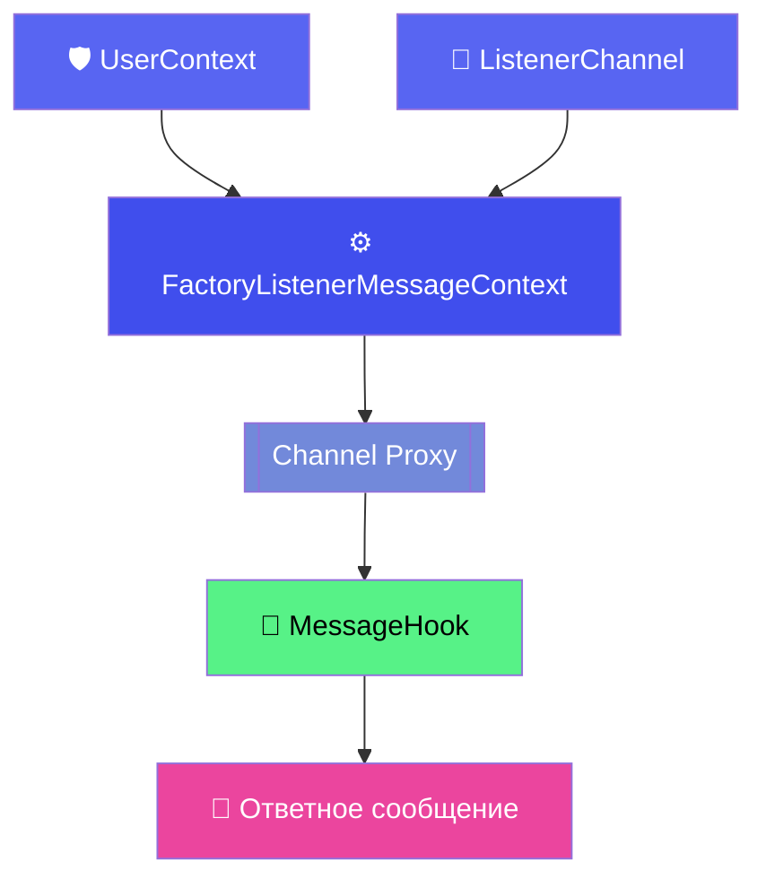

# 🚀 DiscordStreamChannel - AOP мониторинг каналов Discord

[](https://spring.io/)
[](https://java.com/)

> **AOP-решение для мониторинга каналов Discord через Spring Framework**

## 🌟 Особенности
- **AOP-подход** - аннотации вместо boilerplate кода
- **Многоканальный мониторинг** - неограниченное количество слушателей
- **Reactive Streams** - асинхронная обработка сообщений
- **Простая интеграция** - минимум кода для старта

## 🛠 Быстрый старт

### 1. Создание пользователя
```java
@UserContext(token = "YOUR_BOT_TOKEN")
public class BotUser {
    @Username
    public String username() {
        return "MyDiscordBot";
    }
}
```


## ⚠️ Важное ограничение
**Класс пользователя должен быть в единственном экземпляре** во всем приложении.

---

## 🛠 Настройка слушателя канала

```java
/**
 * Класс-слушатель сообщений в Discord канале
 * @channelId - ID целевого канала
 * @guildId - ID сервера (гильдии)
 */
@ListenerChannel(
    channelId = "YOUR_CHANNEL_ID",  // Замените на реальный ID канала
    guildId = "YOUR_GUILD_ID"       // Замените на реальный ID сервера
)
public class ChannelListener {
    
    private final ListenContextHelper helper;

    /**
     * Конструктор с ленивой инициализацией помощника
     * @Lazy - обязательно для предотвращения циклических зависимостей
     */
    @Lazy
    public ChannelListener(ListenContextHelper helper) {
        this.helper = helper;
    }

    /**
     * Обработчик входящих сообщений
     * @MessageHook - отмечает метод как обработчик сообщений
     */
    @MessageHook
    public ListenerCallback onMessage() {
        return (message, userProxy) -> {
            // Отправляем ответное сообщение
            helper.defaultMessageSender(
                message.getChannel_id(), 
                "Я получил ваше сообщение!"
            );
        };
    }
}
```

## 🏗 Архитектурная схема



## 🛠️ Вспомогательные методы `ListenContextHelper`

Класс предоставляет два основных метода для работы с Discord API:

### 1. Отправка сообщения с обработкой результата
```java
/**
 * Отправляет сообщение в указанный канал
 * @param channelId ID Discord канала
 * @param message Текст сообщения
 * @return Mono<DiscordMessageResponse> с результатом операции
 */
public Mono<DiscordMessageResponse> sendMessageWithResponse(
    String channelId, 
    String message
) {
    return discordWebClient.post()
        .uri("/channels/{channelId}/messages", channelId)
        .contentType(MediaType.APPLICATION_JSON)
        .bodyValue(Map.of("content", message))
        .retrieve()
        .bodyToMono(DiscordMessageResponse.class)
        .doOnSuccess(response -> 
            log.info("Сообщение отправлено: {}", response.id())
        )
        .doOnError(e -> 
            log.error("Ошибка отправки: {}", e.getMessage())
        );
}
```

## ⚠️ Критически важные ограничения

### 1. Конфигурация пользователя
```diff
- Допускается только ОДИН класс с @UserContext в приложении
+ Правильно:
@UserContext(token = "ваш_токен")
public class ExampleUser { ... }

- Неправильно (вызовет исключение):
@UserContext(token = "токен1") class UserExample1 { ... }
@UserContext(token = "токен2") class UserExample2 { ... }
```

# 🚀 Подключение Discord Channel Stream к вашему проекту

## 📌 Простое подключение через Maven

Скопируйте этот блок в ваш `pom.xml`:

```xml
<dependency>
    <groupId>ru.optimus.discord.channelstream</groupId>
    <artifactId>discord-channel-stream</artifactId>
    <version>0.0.8</version>
</dependency>
```
